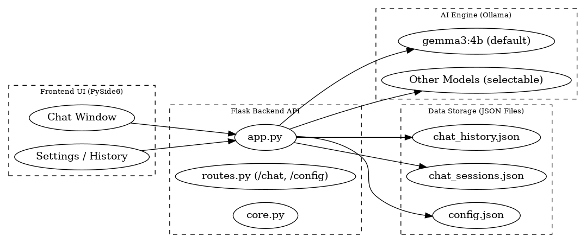

# Local AI Assistant - Changli UI
          


---

🚧 **Status:** This project is still in **development**, so expect bugs, incomplete features, & potential breaking changes. 🚧

---

## 📖 Description
Local AI Assistant is an **offline/local AI chat application** featuring:
- **Backend** built with Flask → API communication and chat storage.
- **Frontend (UI)** built with PySide6 (Qt) → interactive chat interface.
- **Ollama Integration** → run local AI models (default: `gemma3:4b`, now supports model selection).

This project is designed to run AI **fully locally**, with customizable identity, persona, profile, memory, and chat history.

---

## 📂 Project Structure
```
local-ai-assistant/
├─ app.py                    
│
├─ backend/
│  ├─ config.py      
│  ├─ core.py           
│  ├─ persona.py            
│  ├─ storage.py             
│  ├─ ollama_client.py       
│  └─ routes.py              
│
├─ ui/
│  ├─ main.py               
│  ├─ chat_window.py         
│  ├─ client.py              
│  ├─ worker.py              
│  └─ widgets/              
│     ├─ settings.py         
│     ├─ history.py          
│     ├─ bubbles.py          
│     └─ identity.py        
│
├─ data/                    
│  ├─ chat_history.json
│  ├─ chat_sessions.json
│  ├─ ui_chat_config.json
│  └─ config.json
│
└─ README.md                 
```

## 🏗 Architecture



---

## ⚡ Features
- 🖥 **Modern UI** using PySide6 (Qt)
- 📝 **Chat History** → rename, delete, or continue past sessions
- 🎭 **Custom Persona** → change AI name, user name, and prompt
- 👤 **Profile System** → add personal info (e.g. *What do you do*, *Anything else the AI should know*)
- 🧠 **Chat Memory** → AI remembers up to **8 previous messages**
- 🎨 **Custom Background** → solid color or custom image
- ⚙️ **Flask Backend** with `/chat`, `/chats`, `/config` endpoints
- 🤖 **Ollama Integration** → run local AI models; default `gemma3:4b`, now supports **model selection**
- 📂 All data & configs stored locally under `data/`

---

## 🛠️ Installation & Setup

### 1. Clone Repository
```bash
git clone https://github.com/rillToMe/local-ai-assistant.git
cd local-ai-assistant
```

### 2. Create Virtual Environment (recommended)
```bash
python -m venv venv
source venv/bin/activate     # Linux/Mac
venv\Scripts\activate        # Windows
```

### 3. Install Dependencies
```bash
pip install -r requirements.txt
```

**Main dependencies:**
- `flask`
- `flask-cors`
- `requests`
- `PySide6`

> ⚠️ **Note**: Make sure you have installed **[Ollama](https://ollama.ai/)** and the required models (`gemma3:4b` by default). Other models can be selected if installed.

### 4. Run the App
```bash
python app.py
```

- Flask backend will start on `http://127.0.0.1:5000`
- PySide6 UI will automatically open

---

## 🎮 Usage
- Click **Settings** → change background, update **Identity & Prompt**
- Click **History** → view, rename, or continue previous sessions
- Click **Profile** → add info about yourself (used by AI in responses)
- Default AI identity is **Changli** (can be changed via settings)
- Choose available Ollama models via **Model Selection**

---

## 🧩 Model Recommendations  

[](https://ai.google.dev/gemma/docs)
[](https://huggingface.co/Qwen)
[](https://huggingface.co/deepseek-ai)
[](https://openai.com/research/gpt-oss)
[](https://ollama.com/library)

Based on official benchmarks and community tests:  

| Model            | Min RAM (CPU-only)      | Approx. GPU VRAM (BF16 / 4-bit) | Notes |
|------------------|--------------------------|----------------------------------|-------|
| **gemma3:1b**    | ≥ 2 GB RAM               | ~1.5 GB / ~0.9 GB                | Lightweight - runs on old notebooks, but slow (~7–10 tokens/sec) [getdeploying.com](https://getdeploying.com/guides/local-gemma3?utm_source=chatgpt.com), [windowscentral.com](https://www.windowscentral.com/artificial-intelligence/my-seven-year-old-mid-range-laptop-runs-local-ai?utm_source=chatgpt.com) |
| **qwen3:1.8b**   | ≥ 2 GB RAM               | ~2 GB / ~1 GB (est.)             | Slightly better reasoning - light enough for laptops |
| **gemma3:4b**    | ≥ 4 GB RAM               | ~6.4 GB / ~3.4 GB                | Recommended default - good speed & quality [getdeploying.com](https://getdeploying.com/guides/local-gemma3?utm_source=chatgpt.com), [ai.google.dev](https://ai.google.dev/gemma/docs/core?utm_source=chatgpt.com) |
| **qwen3:4b**     | ≥ 4 GB RAM               | ~6 GB / ~3 GB (est.)             | Balanced - strong chat & reasoning |
| **gemma3:12b**   | ≥ 9 GB RAM               | ~20 GB / ~8.7 GB                 | Requires strong GPU or high RA[getdeploying.com](https://getdeploying.com/guides/local-gemma3?utm_source=chatgpt.com), [ai.google.dev](https://ai.google.dev/gemma/docs/core?utm_source=chatgpt.com) |
| **qwen3:8b**     | ≥ 9 GB RAM               | ~18 GB / ~8 GB (est.)            | Good quality & context |
| **deepseek-r1:8b** | ≥ 9 GB RAM             | ~18 GB / ~8 GB (est.)            | Specialized reasoning |
| **gemma3:27b**   | ≥ 18 GB RAM              | ~46 GB / ~21 GB                  | Heavy - best on high-end GPUs or servers [getdeploying.com](https://getdeploying.com/guides/local-gemma3?utm_source=chatgpt.com), [ai.google.dev](https://ai.google.dev/gemma/docs/core?utm_source=chatgpt.com) |
| **gpt-oss:20b**  | ≥ 32 GB RAM              | ~40 GB / ~20 GB (est.)           | Large - better long context |
| **gpt-oss:120b** | ≥ 128 GB RAM / Multi-GPU | ~120 GB+ / 60 GB+ (est.)         | Experimental - extremely heavy compute requirement |

---

## 📌 Roadmap / Todo
- [ ] Fix UI crash bugs
- [ ] Add multi-tab chat support
- [ ] Add chat export/import
- [ ] Optimize performance for long requests
- [ ] Expand model integration beyond Ollama

---

## ⚠️ Notes
- This is still in **early development**, expect frequent bugs and issues  
- UI/UX is minimal for now, focused on core functionality  
- Default persona is simple, but can be extended with custom prompts  
